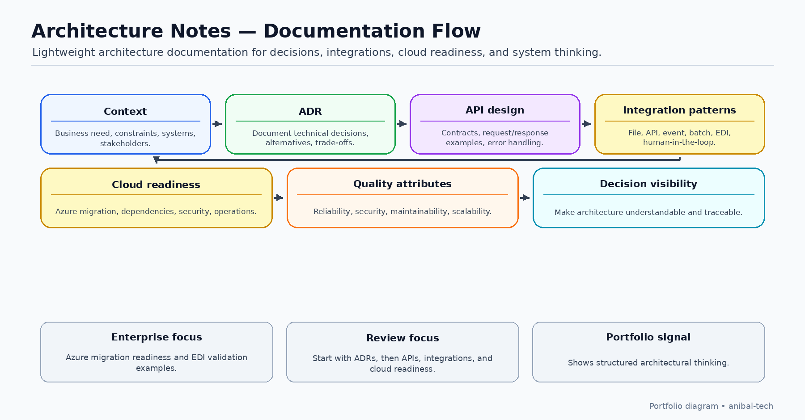

# Architecture Notes

Lightweight documentation for technical decisions, API design, and system thinking.

This repository contains notes, templates, and examples for documenting architecture in a practical and business-oriented way.

## Repository Contents

- [Architecture Decision Record template](docs/architecture-decision-record-template.md)
- [API design guidelines](docs/api-design-guidelines.md)
- [System context example](docs/system-context-example.md)
- [Integration patterns](docs/integration-patterns.md)
- [Quality attributes](docs/quality-attributes.md)
- [Azure migration readiness checklist](docs/azure-migration-readiness-checklist.md)
- [EDI integration validation checklist](docs/edi-integration-validation-checklist.md)
- [Example ADR - AI Email Secretary](examples/adr-001-ai-email-secretary.md)
- [Example ADR - Azure Migration](examples/azure-migration-adr-example.md)
- [API contract example](examples/api-contract-example.md)
- [EDI interface mapping example](examples/edi-interface-mapping-example.md)
- [Diagrams notes](diagrams/README.md)

## Best way to review this repository

This repository is best reviewed as a lightweight architecture documentation library.

Recommended review path:

1. Start with decision documentation:
   - [Architecture Decision Record template](docs/architecture-decision-record-template.md)
   - [Example ADR - AI Email Secretary](examples/adr-001-ai-email-secretary.md)
   - [Example ADR - Azure Migration](examples/azure-migration-adr-example.md)

2. Then review architecture and integration practices:
   - [API design guidelines](docs/api-design-guidelines.md)
   - [Integration patterns](docs/integration-patterns.md)
   - [System context example](docs/system-context-example.md)
   - [Quality attributes](docs/quality-attributes.md)

3. Finally, review enterprise and cloud-specific examples:
   - [Azure migration readiness checklist](docs/azure-migration-readiness-checklist.md)
   - [EDI integration validation checklist](docs/edi-integration-validation-checklist.md)
   - [EDI interface mapping example](examples/edi-interface-mapping-example.md)

The goal of this repository is to show how technical decisions, integration design, cloud migration readiness, and enterprise architecture notes can be documented clearly and connected to business outcomes.

## Purpose

The goal of this repository is to document how technical decisions can be explained clearly, reviewed by teams, and connected to business outcomes.

## Focus Areas

- Architecture decision records
- API design
- System context documentation
- Integration patterns
- EDI integration validation
- Enterprise interface mapping
- Quality attributes
- Cloud migration readiness
- Azure migration planning
- Operational readiness
- Maintainability
- Scalability
- Security and privacy considerations

## Why this matters

Good architecture is not only about diagrams. It is about making decisions visible, understandable, and aligned with business and technical goals.

Architecture documentation helps teams understand why decisions were made, what trade-offs were considered, and how systems should evolve over time.

## Status

Public portfolio version.

This repository is part of my professional GitHub portfolio and provides practical references for architecture documentation, technical decision-making, API design, integration patterns, Azure migration readiness, EDI validation, quality attributes, and system thinking.

The content will continue evolving as new examples, diagrams, architecture notes, and decision records are added.

## Author

**Anibal Arias**  
Software Development Manager focused on technical leadership, software delivery, process improvement, and business-oriented technology solutions.

- GitHub: [anibal-tech](https://github.com/anibal-tech)
- LinkedIn: [anibal-arias](https://www.linkedin.com/in/anibal-arias)
- Website: [tambormayor.com](https://tambormayor.com)
